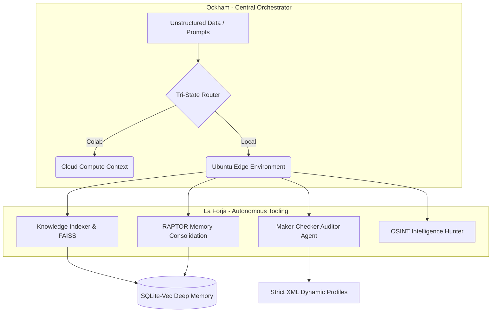

# 🧠 Vromlix Cognitive Architecture

An advanced, deterministic ETL pipeline and Multi-Agent Orchestration system engineered for high-performance execution in resource-constrained environments (Sub-8GB RAM edge computing).

## 🏗️ System Architecture & Workflow

Vromlix operates under a strict "Ockham/Forja" delegation model. The central orchestrator dynamically routes tasks to specialized cognitive tools while enforcing static typing, rigorous formatting, and continuous structural auditing.

## 🚀 Technical Highlights

* **Zero-Bloat Vector Search:** Implements `sqlite-vec` to achieve high-dimensional embeddings (768d) and retrieval-augmented generation (RAG) directly at the edge, meticulously optimized to operate without thrashing on an 8GB RAM host.
* **Resilient API Routing:** Native `google-genai` integration fortified with exponential backoff algorithms and zero-latency key rotation to effortlessly absorb HTTP 429/503 errors and maximize throughput strictly under 30k TPM quotas.
* **Maker-Checker Paradigm:** Deploys a Surgeon/Auditor dual-LLM architecture. Code and data mutations are generated by the Surgeon and mathematically verified by an isolated Forensic Auditor before being committed to the file system.
* **Strict Software Engineering:** Deeply integrated Git pre-commit hooks enforcing rigorous linting (`ruff`), auto-formatting (`black`), and strict static typing (`mypy`) across the entire repository structure.

## 🛠️ Stack & Dependencies
- **Core Engine:** Python 3.10+
- **LLM Orchestration:** `google-genai`, `Groq`
- **Data Engineering:** `pandas`, `lxml`, `sqlite-vec`
- **OSINT & Scraping:** `ddgs`, `feedparser`, `Selenium`

---
*Built for rigorous Personal Knowledge Graph compilation and continuous code refactoring.*

